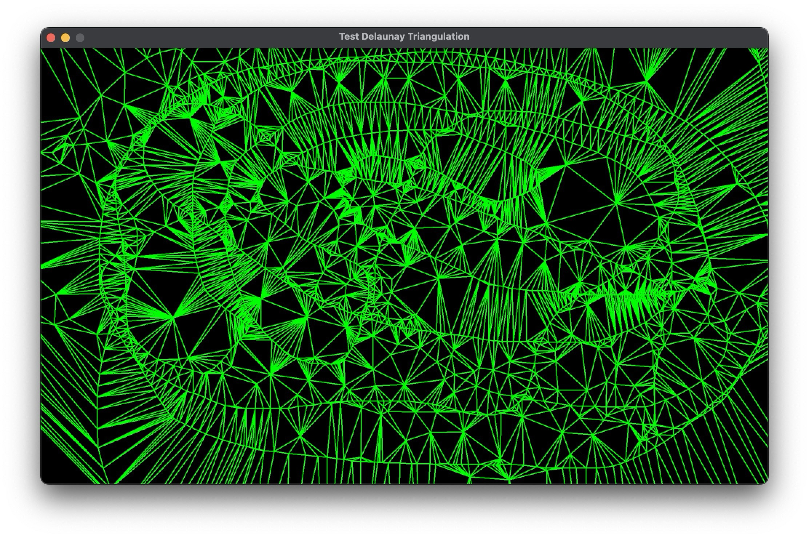
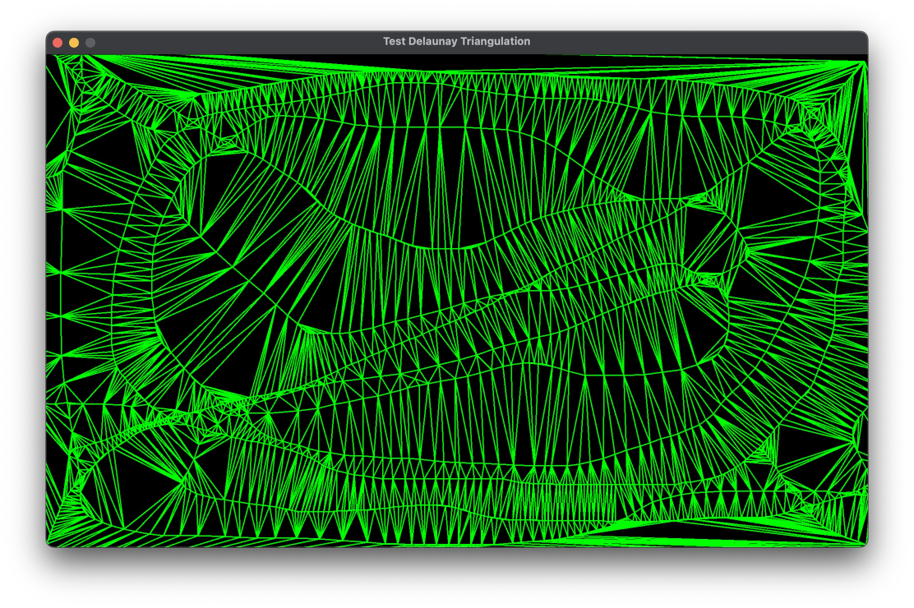

# Interactive Demo of the Delaunay Triangulation in Ebitengine

This example uses Ebitengine to demonstrate the Delaunay Triangulation algorithm.

Uses the implementation of the Delaunay algorithm implemented in Go by [github.com/fogleman/delaunay](https://github.com/fogleman/delaunay)

# Usage

1. Clone the repo `git clone https://github.com/aljanabim/ebiten-delaunay-example.git`
2. `cd ebiten-delaunay-example`
3. `go run main.go`
4. Click and drag on the window that pops up

# Examples

